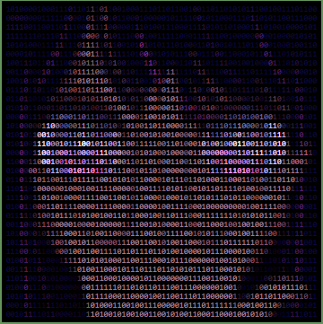

<div align="center">


# Anıl Gülaçtı

### Software Developer&nbsp;&nbsp;·&nbsp;&nbsp;AI Enthusiast&nbsp;&nbsp;·&nbsp;&nbsp;Builder

Ai ile kullanıcı odakları çözüm buluyorum

<br>


<br><br>

[](https://www.linkedin.com/in/an%C4%B1l-g%C3%BCla%C3%A7t%C4%B1-10b80742a/)
[](https://www.instagram.com/anl_gulacti/)
[](mailto:gulactianil01@gmail.com)

</div>

<br>

<table>
<tr>
<td width="55%" valign="top">

## Hakkımda

```js
const anil = {
  name: "Anıl Gülaçtı",
  status: "Lise Öğrencisi",
  role: "Software Developer",
  location: "Türkiye",
  interests: [
    "Yapay Zeka (AI)",
    "Backend Development",
    "Data & SQL",
    "Otomasyon",
    "Ürün Geliştirme"
  ],
  currentlyBuilding: "Yapay zeka destekli akıllı sistemler",
  mindset: "Build. Break. Learn. Improve."
};
```

</td>
<td width="45%" valign="top" align="center">



</td>
</tr>
</table>

- Şu anda yapay zeka ve kullanıcı odaklı projeler üzerinde çalışıyorum
- Dukasim bünyesinde 3 aylık staj yaptım
- Teknofest ve TÜBİTAK yarışmalarında yer aldım
- Erasmus projesi kapsamında uluslararası bir projede yer aldım
- Lise öğrencisi olmama rağmen kendimi sürekli geliştirmeye çalışıyorum

<br>

